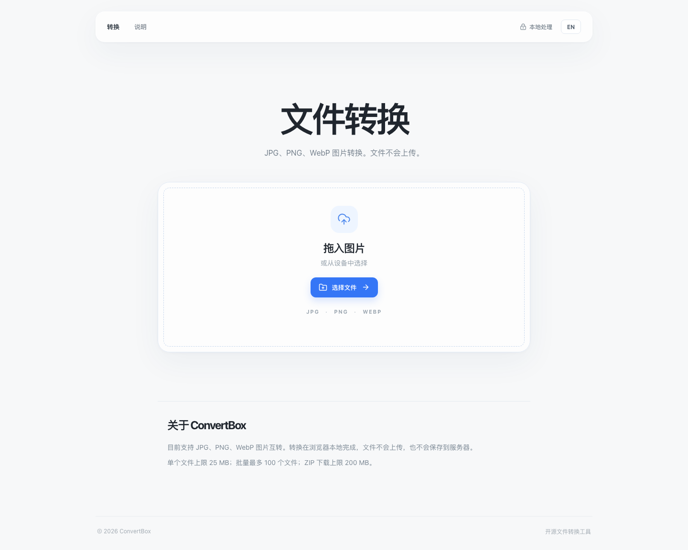
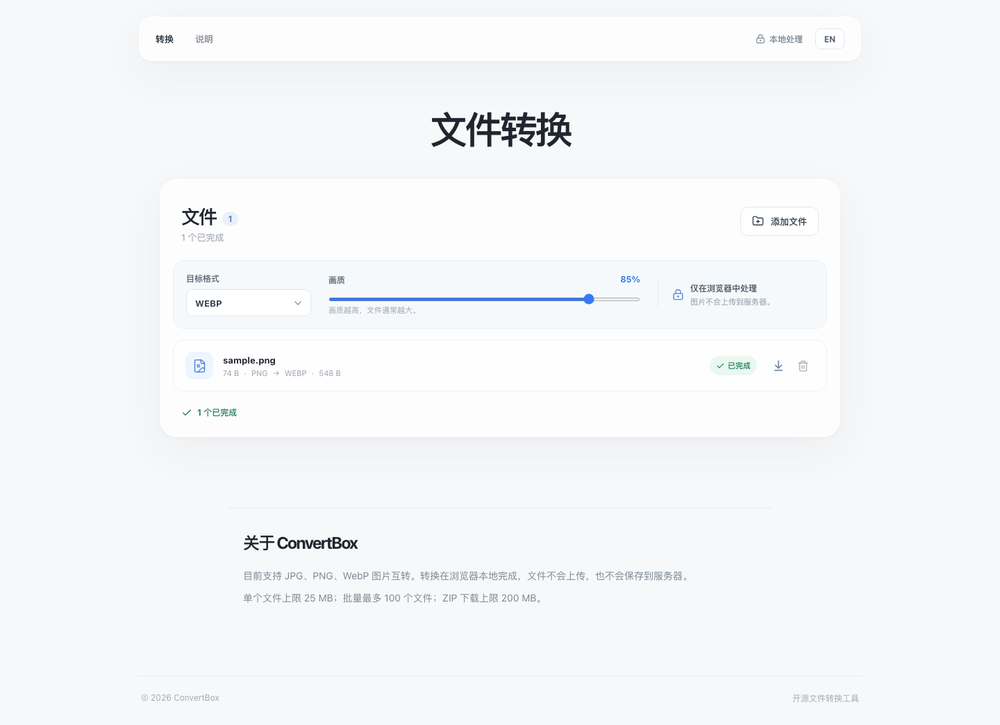
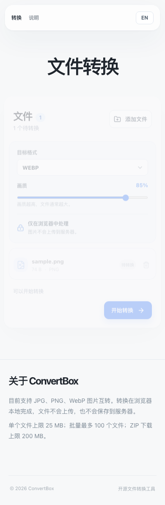

# ConvertBox

A private, no-account image conversion workbench. Phase 1 converts JPG, PNG and WebP locally in your browser. The interface uses Chinese by default, has a complete English switch, and uses restrained Apple-inspired spacing with subtle glass surfaces.

Licensed under [MIT](LICENSE).

## Screenshots







## Features implemented

- Drag/drop or choose up to 100 images; unsupported files are isolated per file.
- Inspect file signature, extension and MIME before conversion.
- Convert JPG, PNG and WebP to any of those three formats, including same-format re-encoding.
- Set JPEG/WebP quality; PNG remains lossless. JPEG output uses a white background for transparent pixels.
- Run a two-at-a-time browser queue with real per-file stages and completed-file batch progress.
- Cancel running/queued jobs, retry failed jobs, remove jobs, download files or a ZIP up to 200 MB.
- Keyboard shortcuts: Cmd/Ctrl+O to choose files; Cmd/Ctrl+Enter to start.
- Small functional animations for drag/drop, active processing and progress; reduced-motion preferences are respected.
- Output images are re-encoded without source metadata.

There is no login, advertising, conversion SaaS, or file upload in Phase 1.

## Architecture

```text
Browser File API → signature detector → capability matrix → bounded queue
                                                   ↓
                                       image Web Worker / Canvas fallback
                                                   ↓
                                           Blob → download / ZIP

Next.js UI       FastAPI boundary (health and empty server capability list)
```

The FastAPI process exists for later server converters. It does **not** receive image files in this release. The current worker is a browser Web Worker, not a server service. The converter protocol and job state models live in `apps/api/convertbox_api/core.py`; server job execution will be added when server formats are implemented. See [architecture](docs/ARCHITECTURE.md) and [pipeline](docs/CONVERSION_PIPELINE.md).

## Supported formats

| Input | Output | Processing | Notes |
| --- | --- | --- | --- |
| JPG/JPEG | JPG, PNG, WebP | Local | WebP output depends on browser support |
| PNG | JPG, PNG, WebP | Local | Transparency becomes white in JPG |
| WebP | JPG, PNG, WebP | Local | Browser must decode WebP |

An image is limited to 25 MB and 80 megapixels. The browser may have a lower practical limit. ZIP generation is limited to 200 MB of converted outputs because it currently assembles the archive in memory. Other formats are not supported yet.

## Development

Requirements: Node.js 22+, npm 10+, Python 3.11+ and `uv` for the optional API. Browser tests require Playwright Chromium.

```bash
npm ci
npm run dev
```

Open [http://localhost:3000](http://localhost:3000). To run the separate API:

```bash
uv run --project apps/api --extra test uvicorn convertbox_api.main:app --host 0.0.0.0 --port 8000
```

The API health endpoint is `http://localhost:8000/health`. `.env.example` reserves settings for future server work; Phase 1 does not read upload or FFmpeg configuration.

## Tests

```bash
npm run lint
npm run typecheck
npm run test
npm run build
npx playwright install chromium
npm run test:e2e
uv run --project apps/api --extra test pytest apps/api/tests
```

Browser tests convert real PNG/JPG/WebP fixtures, inspect output file signatures, and verify a batch ZIP. CI runs all of these checks on pushes and pull requests.

## Docker

```bash
docker compose up --build
```

Web: `http://localhost:3000`; API health: `http://localhost:8000/health`. Browser conversion runs on the visitor's device. The API container has no file upload route in Phase 1.

## Privacy

Images are processed entirely in the browser. They are held in page memory while the workspace is open. Download URLs are revoked after use. ConvertBox does not send image bytes to the Next.js or FastAPI server. The UI explicitly labels this route **Local processing**. Future server routes will be separately labeled **Server** before upload. See [privacy details](docs/PRIVACY.md).

## Security

Detection checks the first bytes, MIME and extension. A conflicting known signature is rejected. Browser decode/encode performs final validation. Download filenames are sanitized and collisions are numbered. Input byte and pixel limits reduce accidental resource exhaustion. The future server security requirements are documented in [SECURITY.md](docs/SECURITY.md).

## Roadmap

Phase 2: HEIC/AVIF, resize, metadata controls and presets after browser support and tests are established. Phase 3: PDF. Phase 4: audio. Phase 5: video and the server queue, streaming upload and FFmpeg progress. Phase 6: local history, themes, deeper performance work and deployment hardening. Planned items are not active features.
